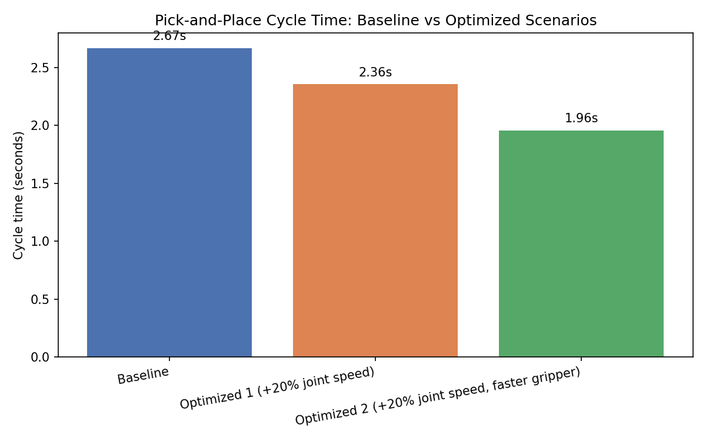

🔗 Live demo: https://agriya2006655.github.io/pick-place-robot-sim/showcase/
# 6-Axis Robotic Pick-and-Place Simulation & Cycle Time Optimization

A two-part project:

1. Simulate a 6-axis robot arm performing a pick-and-place task
   (pick an object from Position A, place it at Position B, return home).
2. Use that simulation to study a real manufacturing-engineering
   question: **how long does one cycle take, and can it be made
   faster without unsafe or unrealistic motion?**

No computer vision, no AI/ML, no ROS. Every pose is a hand-picked set
of joint angles (no inverse kinematics), and cycle time is estimated
using the same simplified method offline robot-programming tools use
for a first-pass timing estimate.

## Files

| File                        | Purpose                                                              |
|-------------------------------|--------------------------------------------------------------------|
| `robot_arm.py`                 | 6-DOF arm model. Forward kinematics only (DH parameters).          |
| `pick_place_task.py`           | Waypoints (Home/Pick/Place) + the 10-step task state machine.      |
| `visualize.py`                 | Renders the run as an animated 3D GIF (`pick_and_place.gif`).      |
| `cycle_time.py`                | Estimates cycle time and compares 3 speed/optimization scenarios.  |

## Part 1 — Simulation

`robot_arm.py` defines the 6 joints via standard DH parameters and
computes forward kinematics (given 6 joint angles, where is every
joint and the gripper tip in 3D space).

`pick_place_task.py` defines 5 fixed waypoints (`HOME`, `PICK_APPROACH`,
`PICK`, `PLACE_APPROACH`, `PLACE`) and runs the task as a 10-step
sequence: Home → Pick approach → Lower → Grip → Lift → Place approach
→ Lower → Release → Lift → Home. Joint angles are linearly interpolated
between waypoints to produce smooth animation frames.

`visualize.py` renders the whole run as an animated 3D GIF.

```bash
python3 pick_place_task.py   # prints the step-by-step task log
python3 visualize.py         # saves pick_and_place.gif
```

## Part 2 — Cycle Time Optimization

**Cycle time** is the total time the robot takes to complete one full
pick-and-place operation, start to finish.

**How it's calculated:** all 6 joints of a real industrial robot move
*simultaneously* during a move, not one at a time — so the time for
any single move is decided by whichever joint has to travel furthest
relative to its own speed limit:

```
segment_time = max( |angle_change of joint i| / max_speed of joint i )
               across all 6 joints
```

Total cycle time = sum of every segment's time, plus a small fixed
"dwell" time each time the gripper opens or closes (a real pneumatic
gripper isn't instant).

`cycle_time.py` compares three scenarios:

| Scenario      | Change                                            |
|----------------|----------------------------------------------------|
| Baseline       | Conservative joint speed limits, 0.4s gripper actuation |
| Optimized 1    | Joint speed limits raised 20% (faster servo tuning) |
| Optimized 2    | Optimized 1 + a quicker 0.2s gripper (faster pneumatic valve) |

```bash
python3 cycle_time.py
```

### Result



| Scenario     | Cycle time | vs Baseline |
|---------------|-----------|-------------|
| Baseline      | 2.67 s    | —           |
| Optimized 1   | 2.36 s    | −11.7%      |
| Optimized 2   | 1.96 s    | −26.7%      |

Raising joint speed alone saves ~12%; combining that with a faster
gripper gets to ~27% faster overall — without changing the actual
pick/place positions or introducing unsafe motion.

## Run everything

```bash
pip install numpy matplotlib pillow

python3 pick_place_task.py
python3 visualize.py
python3 cycle_time.py
```

## Extending later

- Swap the hand-picked joint waypoints for real inverse kinematics to
  specify Pick/Place in Cartesian (x, y, z) instead of joint angles.
- Replace the fixed `PICK` waypoint with a value read from a simulated
  or real sensor (this is where computer vision would plug in).
- Add trapezoidal (accel–cruise–decel) velocity profiles instead of a
  constant-speed assumption, for a more realistic cycle time estimate.
